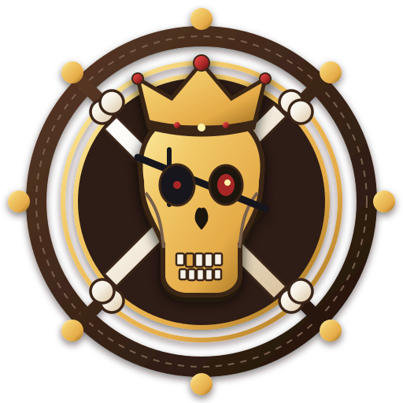

<div align="center">
  
  <h1>Skull King Companion</h1>
  <p><strong>A modern, mobile-first, 100% offline PWA companion & scorekeeper for the legendary trick-taking card game <em>Skull King</em> (Grandpa Beck's Games).</strong></p>

[](https://react.dev/)
[](https://www.typescriptlang.org/)
[](https://tailwindcss.com/)
[](https://vitejs.dev/)
[](https://www.docker.com/)
[](https://coolify.io/)
[](https://github.com/Kibishi47/skull-king-companion)
[](LICENSE)

</div>

> **Crafted with an authentic pirate parchment aesthetic to replace messy paper sheets at your gaming table.**
>
> 🇫🇷 **Note on Language:** The user interface, terminology (*plis, mises, manches, bonus, etc.*), and game flow are **exclusively in French**, aligned with the official French edition rules and phrasing.

---

## 📖 Overview & Problem Solved

Anyone who has played **Skull King** knows the pain of paper scorekeeping:
- Mental math errors calculating tricky zero-bid escalations ($\pm 10 \times \text{cards}$) and negative score differences.
- Erased, unreadable pencil marks under tavern lighting.
- Forgetting Rascal options, siren captures, or booty alliance bonuses.
- Slowing down the electric rhythm of *“Yo-ho-ho!”* rounds.

**Skull King Companion** solves all of this. Designed primarily for handheld smartphone use right beside the deck, it delivers instant bidirectional score computing, rock-solid integrity validation, non-destructive round corrections, and an authentic pirate score sheet replica (in French).

---

## ⚡ Detailed Features

### 🧮 Official Scoring Engine
- **Classic Scoring Mode:**
  - **Bid Met ($Bid = Tricks$):** $+20$ points per trick won.
  - **Bid Missed ($Bid \ne Tricks$):** $-10$ points per trick of difference ($|Bid - Tricks| \times 10$), regardless of whether you took more or fewer tricks.
  - **Zero Bid ($Bid = 0$):**
    - Success: $+10 \times \text{Cards in Round}$.
    - Failure: $-10 \times \text{Cards in Round}$.
- **Rascal Scoring Mode (The Gambler Variant):**
  - **Direct Hit ($Bid = Tricks$):** $100\%$ score payout.
  - **Backhand Strike ($|Bid - Tricks| = 1$):** Half payout ($50\%$ points, rounded down).
  - **Crushing Defeat ($|Bid - Tricks| \ge 2$):** $0$ points for the round.
  - **Rascal Option:** Toggle between *Boulet de canon* (all-in cannonball) and *Chevrotine* (buckshot margin).
- **Comprehensive Bonus Tracker (Slide-over Drawer):**
  - **Standard 14s (Colored Suits):** $+10$ pts each.
  - **Black 14 (Jolly Roger):** $+20$ pts.
  - **Pirate captures Mermaid:** $+20$ pts each.
  - **Skull King captures Pirate:** $+30$ pts each.
  - **Mermaid captures Skull King:** $+40$ pts each.
  - **Loot / Alliance Bounties:** $+20$ pts each.
  - **Rascal Bets:** Additional risk/reward bonus points.

### 📱 Mobile-First & iOS PWA Experience
- **Fully Installable PWA:** Installable on iOS Safari ("Add to Home Screen") and Android Chrome ("Install App") under the official name **Skull King Companion**.
- **Standalone App Mode:** Fullscreen web app with zero browser chrome (`display: standalone`, custom theme `#c9933b`, dark aged leather background `#0a0f1d`, Apple touch icons).
- **iOS Safari & Dynamic Island / Notch Aware:** Layout dynamically adheres to iOS safe areas using `env(safe-area-inset-top)`, `env(safe-area-inset-bottom)`, etc.
- **Anti-Zoom Guard:** `touch-action: manipulation` and meta viewport restrictions (`user-scalable=no`, `viewport-fit=cover`) prevent accidental double-tap zooming during intense bidding rounds.
- **Single-Line Action Bars:** Zero-wrapping (`whitespace-nowrap`) responsive buttons designed for thumb ergonomics.
- **Minimalist Header & Vector Identity:** Clean navigation featuring the custom vector Skull King logo (transparent background, authentic crossbones with articulated rounded heads, subtle layer drop-shadows).

### 👥 Table & Player Roster Management
- Supports **2 to 8 players**.
- **No Generic Placeholders:** Players must enter real pirate names; no unwanted fallback names like "Player X".
- **Dynamic Seating Rearrangement:** Reorder seats up/down with arrow controls to match physical dealer rotation around the table.
- **Persistent Roster & Fast Picker:** Pick previous players from a drawer powered by `localStorage`, with instant search and roster deletion options.

### 🎯 Modular Round Presets & Custom Sequences
Choose your preferred voyage length or craft your own:
- **Standard 10 Rounds:** The official progression ($1, 2, 3, 4, 5, 6, 7, 8, 9, 10$ cards).
- **Battle Ready:** Fast-paced heavy combat ($6, 7, 8, 9, 10$ cards).
- **Blitz:** Quick sprint ($1, 3, 5, 7, 10$ cards).
- **No Odd Numbers:** Even rounds only ($2, 4, 6, 8, 10$ cards).
- **Whirlpool (Tourbillon):** Ascending then descending ($1, 3, 5, 7, 10, 7, 5, 3, 1$ cards).
- **Custom Sequence Builder:** Configure anywhere from 1 to 20 rounds, setting each round to any card count between 1 and 10. Allows empty editing without frustrating input locks.

### 🛡️ Non-Destructive Editing & Integrity Checks
- **Strict Trick Integrity:** Cannot advance until $\sum \text{Tricks Won} = \text{Cards in Round}$.
- **Non-Destructive Correction:** Editing a past round deeply clones previous bids, tricks, and bonuses. Values are **never wiped**, allowing seamless, stress-free corrections mid-game.
- **Cascade Recalculation:** Editing any earlier round immediately cascades corrected cumulative totals through every subsequent round and automatically returns you to the active round.

### 📊 Dual Scoreboard Views (Modern Bottom Sheet)
1. **Leaderboard Tab (Default):** Instant standings with gold/silver/bronze badges, point differentials, and current rankings.
2. **Matrix Score Grid Tab:** A faithful digital reproduction of the official physical scorecard showing individual round rows, slash notation (bid / won), and running cumulative totals.

### 💾 100% Client-Side Local Storage & Offline-First
- Automatic game auto-save upon every action under `skull_king_active_game`.
- Service Worker registration via `virtual:pwa-register` (`registerType: 'autoUpdate'`) caching all assets (`js`, `css`, `html`, `svg`, `png`, `woff2`) for full offline gameplay at the tavern or cabin.
- Multi-game archive manager under `skull_king_saved_games` with timestamps and winner badges.

---

## 🏗️ Architecture & Project Structure

```text
skull-king-companion/
├── public/                     # Static assets, PWA icons, manifest
│   ├── apple-touch-icon.png    # iOS Safari icon (180x180, solid aged leather background)
│   ├── favicon.svg             # Transparent vector pirate skull & wheel favicon
│   ├── icon-192.png            # Android PWA icon (192x192, maskable & standard)
│   └── icon-512.png            # High-definition PWA icon (512x512, maskable & standard)
├── scripts/
│   └── generate-icons.cjs      # Automated macOS Cocoa/sips PWA icon builder
├── src/
│   ├── components/             # React UI components
│   │   ├── BonusDrawer.tsx     # Slide-over bottom sheet for round bonuses
│   │   ├── GameOverPodium.tsx  # End-game victory podium & confetti celebration
│   │   ├── GameSetup.tsx       # Player roster setup, presets & custom sequence
│   │   ├── ParchmentUI.tsx     # Reusable skeuomorphic pirate parchment primitives
│   │   ├── PlayerPickerModal.tsx# Saved player search & management drawer
│   │   ├── RoundEntry.tsx      # Dual-step round wizard (1: Bids, 2: Tricks & Bonuses)
│   │   ├── RoundRecap.tsx      # Inter-round scoreboard recap & edit triggers
│   │   ├── SavedGamesModal.tsx # Historical games drawer
│   │   ├── ScoreboardModal.tsx # Leaderboard & official matrix score sheet drawer
│   │   └── SkullKingLogo.tsx   # Handcrafted transparent vector SVG logo with drop-shadow
│   ├── hooks/
│   │   └── useGameManager.ts   # Core game lifecycle, state transitions & persistence
│   ├── types/
│   │   └── game.ts             # TypeScript definitions (GameState, Round, Player, etc.)
│   ├── utils/
│   │   ├── presets.ts          # Official and custom round sequence presets
│   │   ├── scoring.ts          # Pure scoring algorithms (Classic, Rascal, Zero-bids)
│   │   └── scoring.test.ts     # Vitest unit test suite for scoring edge cases
│   ├── App.tsx                 # Main root router, safe area wrapper & layout
│   ├── index.css               # Parchment styling tokens & Tailwind base directives
│   └── main.tsx                # React 19 entry point & Service Worker registration
├── Dockerfile                  # Multi-stage production build (Alpine + Nginx)
├── nginx.conf                  # Nginx configuration (SPA routing, Gzip, cache policies)
├── tailwind.config.js          # Custom parchment, gold, and wax pirate color palette
├── tsconfig.app.json           # TypeScript config including vite-plugin-pwa/client types
├── vite.config.ts              # Vite & VitePWA configuration (autoUpdate, manifest, Workbox)
└── package.json
```

### Tech Stack
- **Framework:** [React 19](https://react.dev/) + [TypeScript](https://www.typescriptlang.org/)
- **Bundler & Tooling:** [Vite 6](https://vitejs.dev/) + [Vitest](https://vitest.dev/)
- **Styling:** [Tailwind CSS 3.4](https://tailwindcss.com/) with custom pirate theme tokens
- **Icons:** [Lucide React](https://lucide.dev/)
- **PWA Engine:** [vite-plugin-pwa](https://vite-pwa-org.netlify.app/) (Workbox Service Worker)
- **Effects:** [canvas-confetti](https://www.npmjs.com/package/canvas-confetti)
- **Containerization:** Docker (Alpine Linux) + Nginx

---

## 🚀 Installation & Local Development

### Prerequisites
- **Node.js:** `v18.0.0` or higher (Node 22 LTS recommended)
- **npm:** `v9.0.0` or higher

### Getting Started

1. **Clone the repository:**
   ```bash
   git clone https://github.com/Kibishi47/skull-king-companion.git
   cd skull-king-companion
   ```

2. **Install dependencies:**
   ```bash
   npm install
   ```

3. **Start the development server:**
   ```bash
   npm run dev
   ```
   Open your browser at `http://localhost:5173`.

4. **Run tests & quality checks:**
   ```bash
   npm run test:run     # Run Vitest test suite
   npm run lint         # Run Oxlint
   ```

5. **Generate PWA icons (optional):**
   ```bash
   node scripts/generate-icons.cjs   # Generates 512x512, 192x192, and apple-touch-icon
   ```

6. **Build for production:**
   ```bash
   npm run build
   npm run preview      # Preview compiled production build locally
   ```

---

## 🐳 Docker & Coolify Deployment

The application is containerized using a multi-stage `Dockerfile` producing an ultra-lightweight Nginx container (~25MB) with hardened headers and aggressive Gzip compression.

### Dockerfile Breakdown

```dockerfile
# Stage 1: Build the Vite React PWA
FROM node:22-alpine AS builder
WORKDIR /app
COPY package*.json ./
RUN npm ci
COPY . .
RUN npm run build

# Stage 2: Ultra-lightweight Alpine Nginx runtime
FROM nginx:alpine
COPY nginx.conf /etc/nginx/conf.d/default.conf
COPY --from=builder /app/dist /usr/share/nginx/html
EXPOSE 80
CMD ["nginx", "-g", "daemon off;"]
```

### Nginx SPA & PWA Configuration (`nginx.conf`)

```nginx
server {
    listen 80;
    server_name localhost;
    root /usr/share/nginx/html;
    index index.html;

    gzip on;
    gzip_types text/plain text/css application/json application/javascript image/svg+xml;

    # Immutable cache for versioned assets
    location ~* \.(?:css|js|woff2?|svg|png|jpg|webp)$ {
        expires 1y;
        add_header Cache-Control "public, immutable";
        try_files $uri =404;
    }

    # Fresh Service Worker & manifest delivery
    location ~* (sw\.js|manifest\.webmanifest|registerSW\.js)$ {
        expires -1;
        add_header Cache-Control "no-store, no-cache, must-revalidate";
    }

    # SPA routing fallback
    location / {
        try_files $uri $uri/ /index.html;
    }
}
```

### Deploying to Coolify in 4 Steps

1. **New Application:** In your Coolify dashboard, select **New Resource** > **Application** > **Public / Private Git Repository**.
2. **Repository Configuration:** Point to this repository (`main` branch) and select **Dockerfile** as the Build Pack.
3. **Ports & Domain:** Map your custom domain (e.g. `skullking.yourdomain.com`) to container port `80`.
4. **Deploy:** Click **Deploy**. Coolify will execute the multi-stage build, configure Let's Encrypt SSL automatically, and serve your app.

---

## 📋 Quick Scoring Reference Table

| Situation | Condition | Classic Mode Points | Rascal Mode Points |
| :--- | :--- | :--- | :--- |
| **Bid Made ($> 0$)** | $Tricks = Bid$ | $+20 \times Tricks$ | $+20 \times Tricks$ ($100\%$) |
| **Bid Missed ($> 0$)** | $|Tricks - Bid| = 1$ | $-10 \times 1$ | $50\%$ of target score |
| **Bid Missed ($> 0$)** | $|Tricks - Bid| \ge 2$ | $-10 \times \|Tricks - Bid\|$ | $0$ points |
| **Zero Bid Made** | $Bid = 0 \land Tricks = 0$ | $+10 \times \text{Cards in Round}$ | $+10 \times \text{Cards in Round}$ |
| **Zero Bid Failed** | $Bid = 0 \land Tricks > 0$ | $-10 \times \text{Cards in Round}$ | $-10 \times \text{Cards in Round}$ |
| **Color 14s** | Taken in trick | $+10$ pts each | $+10$ pts each |
| **Black 14 (Jolly Roger)** | Taken in trick | $+20$ pts | $+20$ pts |
| **Pirate captures Mermaid** | Taken in trick | $+20$ pts each | $+20$ pts each |
| **Skull King captures Pirate** | Taken in trick | $+30$ pts each | $+30$ pts each |
| **Mermaid captures Skull King** | Taken in trick | $+40$ pts each | $+40$ pts each |
| **Loot / Alliances** | Successful alliance | $+20$ pts each | $+20$ pts each |

> *Note: Bonus points are only awarded if the player succeeds in making their declared bid (except under specific Rascal house rule configurations).*

---

## ⚖️ Disclaimer & License

### Disclaimer
This project is an unofficial fan-made digital companion created for personal gaming sessions. **Skull King** is a board/card game designed by Brent Beck, Jeffrey Beck, and Tauni Beck, published by **Grandpa Beck's Games**. All rights, trademarks, and game mechanics belong to their respective owners. Support the creators by purchasing the official physical game!

### License
This project is open-source software licensed under the **[MIT License](LICENSE)**.
